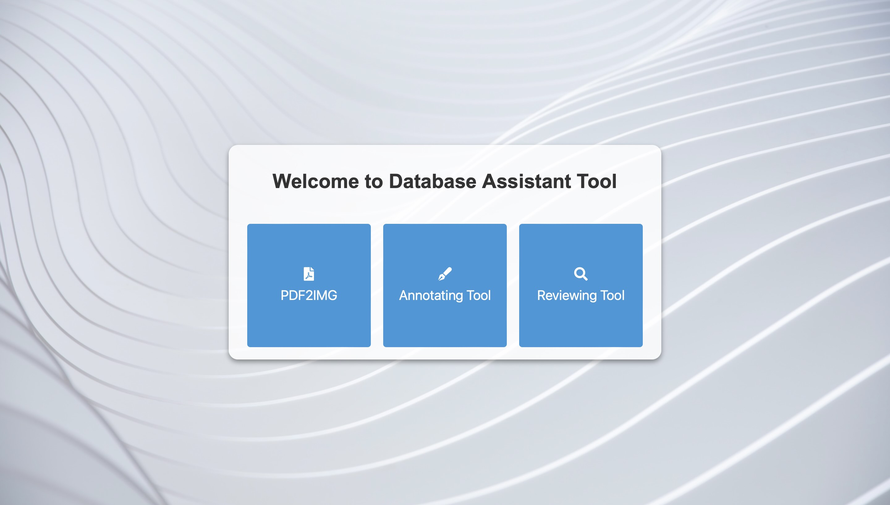
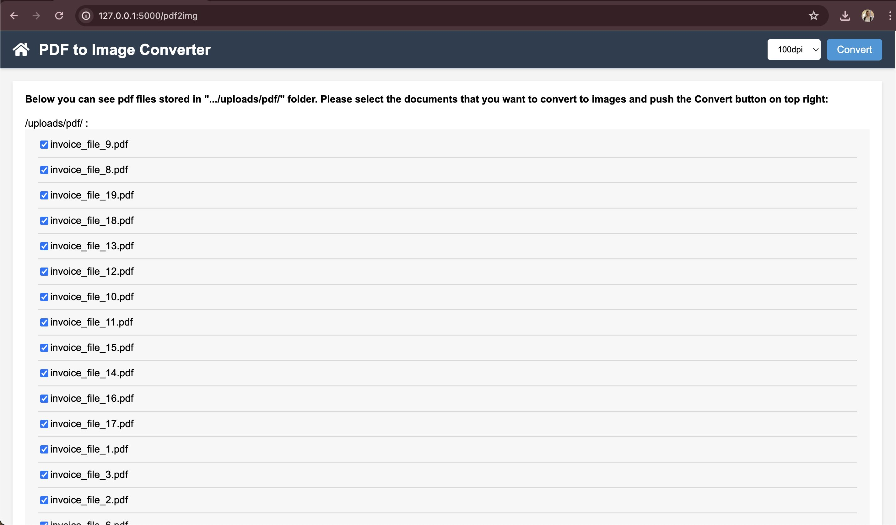
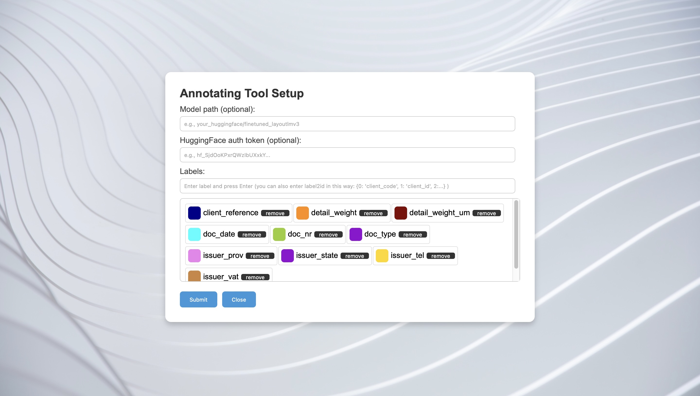

# Annotator Assistant

Welcome to Annotator Assistant, a tool designed to streamline your annotation processes with integrated OCR capabilities.

## Table of Contents
- [Installation](#installation)
  - [Clone the Repository](#clone-the-repository)
  - [Set Up Python Environment](#set-up-python-environment)
  - [Install Dependencies](#install-dependencies)
  - [Configure OCR](#configure-ocr)
  - [Launch Application](#launch-application)
- [Features](#features)
  - [PDF to Image Conversion](#pdf-to-image-conversion)
  - [Image Annotation](#image-annotation)
  - [Reviewing Tool](#reviewing-tool)
- [Labels Cheatsheet](#labels-cheatsheet)
- [License](#license)
- [Contributing](#contributing)

## Installation

Follow these steps to get the app running on your local machine:

### Clone the Repository
Start by cloning the repository to your local machine. Open your terminal and run the following command:

```bash
git clone https://github.com/alitavanaali/annotator_assistant.git
```

### Set Up Python Environment (Optional)
Navigate to the directory where you cloned the repository and set up a virtual environment. This is an optional but recommended step to manage dependencies effectively.

```bash
cd annotator_assistant
```
```bash
python3 -m venv venv
```
```bash
source venv/bin/activate
```

### Install Dependencies
Install all the required packages using the following pip command:

```bash
pip install -r requirements.txt
```

### Configure OCR
For using Optical Character Recognition (OCR), place your Google Cloud Platform (GCP) json file certificate in the following directory:

```bash
certificates/GCP_APIKEY.json
```

### Launch Application
Finally, start the application by running:

```bash
python app.py
```

and open in browser: 
```bash
http://127.0.0.1:5000/
```



<br><br>
---
<br><br>

## Features

### PDF to Image Conversion

In this tool, you can convert PDF files into images. To do this, copy the PDF files you want to convert into the folder:
```bash
uploads/pdf
```

Then, click on "PDF2IMG" on the homepage. On the next page, you will see a list of available PDF files in the uploads/pdf folder. Select the DPI you want among 100, 200, and 300, and push the convert button on the top right. Images will be stored in the uploads/images folder.



<br><br>
---
<br><br>

#### Image Annotation
The Image Annotator tool allows you to annotate images effectively. Here's how to use it:

#### Uploading Images
To start annotating, upload the images you want to work on into the following directory:
```plaintext
uploads/images
```
<br>



After placing the images in their designated folder, click on the Annotating Tool to open a setup page. A popup box will appear where you need to configure the following settings to enable automated or manual annotation:

* Model Address from Hugging Face (Optional): This is optional. If you have access to a pretrained model and want to use it for automated labeling, enter the model’s address, such as microsoft/layoutlmv3-base. If no model address is provided, you will need to annotate documents manually.
    ```plaintext
    DataIntelligenceTeam/pharma_label_v3.2
    ```
* Hugging Face Token: This token is necessary for connecting to private models on Hugging Face. Ensure you have the correct permissions and the token ready.
Labels for Your Project:
    - Manual Entry: Enter each label individually. After typing a label name, press Enter to add it to the label container.
       
    - Bulk Entry: For projects with a large number of labels, such as the Passive Invoice project with over 50 labels, manually entering each label can be time-consuming. Instead, you can input them as a Python dictionary in the text box. The application will parse this input and convert it into the necessary labels for your project.
    for example in 'Pharma Label' project if we enter this dictionary

    ```plaintext
    {0: 'box_id', 1: 'client_id', 2: 'client_name', 3: 'client_address', 4: 'giro', 5: 'date', 6: 'time', 7: 'others', 8: 'picking', 9: 'client_city', 10: 'client_cap', 11: 'client_prov', 12: 'sender_name'}
    ```
    all the labels will import correctly. at the end of this readme file you can see the list of these dictionaries for each project to facilitate inserting of them in your project.

#### Navigating Images
Once uploaded, you can view your images in the left panel of the Image Annotator page. Navigate between images by clicking on them.

#### Tool Features and Shortcuts
The annotator is equipped with several features to enhance your annotation experience, accessible through keyboard shortcuts:

| Shortcut | Description |
|----------|-------------|
| `+` | Increase the view size of the image. |
| `-` | Decrease the view size of the image. |
| `h` | Toggle the visibility of rectangles around words. |
| `l` | Toggle the display of label names on the rectangles. |
| `m` | Hide or display the right panel. |
| `Arrow Left/Right` | Move between images in the directory. |
| `Cmd + S` | Save the current annotations. The annotated data is saved as a CSV file in `uploads/reviewed`. |
| `Cmd + O` | Perform Optical Character Recognition (OCR) on the current image to detect text automatically. |
| `Cmd + P` | Automatically predict labels for the image elements. |

<br><br>
---
<br><br>

### Reviewing Tool

The Reviewing Tool in our application offers a robust method to ensure the quality of data annotations. There are two primary ways to review the annotations:

<br><br>

As previously described, the Annotating Tool allows users to manually annotate documents and verify annotations by visual inspection. Each label displayed on top of a rectangle has its own color, aiding in quickly identifying discrepancies or errors. This method, while straightforward, relies heavily on the annotator’s ability to catch mistakes, making it less foolproof.
<br>
### AI-Driven Review
The third component of our app, the Reviewing Tool, introduces an AI-powered approach to verify annotations. This tool utilizes a pretrained AI model to predict labels for annotated documents, allowing users to compare the manually annotated labels against those predicted by the model. This process simulates having two independent reviews for each document, enhancing accuracy and consistency in the annotations.
<br>
Requirements for Using the Reviewing Tool:

* Database of Annotated Documents: Essential for providing the baseline against which the AI model will compare new annotations.
* Pretrained Model: Used to generate label predictions that will be compared to your annotations.


#### Important Note:

The Reviewing Tool is specifically designed for use with documents that have already been annotated. If your data has not yet been annotated, it is recommended to use the Annotating Tool first. Once your documents are annotated, you can then employ the Reviewing Tool to re-evaluate the annotations, ensuring maximum accuracy and reliability in your dataset.
<br>
By integrating this AI-driven reviewing process, we aim to significantly reduce the error rate commonly associated with manual verification, making it a vital part of maintaining high standards in data annotation.


<br><br>
---
<br><br>

## Labels Cheatsheet

| Project | List of labels as python dictionary |
|----------|-------------|
| Manifesti | {0: 'container id', 1: 'seal number', 2: 'container quantity', 3: 'container type', 4: 'tare', 5: 'package quantity', 6: 'weight', 7: 'others'} |
| Pharma Label | {0: 'box_id', 1: 'client_id', 2: 'client_name', 3: 'client_address', 4: 'giro', 5: 'date', 6: 'time', 7: 'others', 8: 'picking', 9: 'client_city', 10: 'client_cap', 11: 'client_prov', 12: 'sender_name'} |
| VGM | {0: 'authorized person', 1: 'container type', 2: 'container id', 3: 'booking number', 4: 'vgm', 5: 'signer name', 6: 'shipper', 7: 'others'} |
| Passive Invoice | {0: 'client_code', 1: 'client_id', 2: 'client_reference', 3: 'client_vat', 4: 'delivery_place', 5: 'detail_desc', 6: 'detail_packnr', 7: 'detail_packtype', 8: 'detail_qty', 9: 'detail_weight', 10: 'detail_weight_um', 11: 'doc_date', 12: 'doc_nr', 13: 'doc_type', 14: 'issuer_addr', 15: 'issuer_cap', 16: 'issuer_city', 17: 'issuer_contact', 18: 'issuer_contact_email', 19: 'issuer_contact_phone', 20: 'issuer_fax', 21: 'issuer_name', 22: 'issuer_prov', 23: 'issuer_state', 24: 'issuer_tel', 25: 'issuer_vat', 26: 'operation_code', 27: 'order_date', 28: 'order_nr', 29: 'others', 30: 'pickup_date', 31: 'pickup_place', 32: 'receiver_addr', 33: 'receiver_cap', 34: 'receiver_city', 35: 'receiver_fax', 36: 'receiver_name', 37: 'receiver_prov', 38: 'receiver_state', 39: 'receiver_tel', 40: 'receiver_vat', 41: 'recipient_name', 42: 'ref_nr', 43: 'sender_name', 44: 'service_date', 45: 'service_date-end', 46: 'service_key', 47: 'service_order', 48: 'service_value', 49: 'shipment_nr', 50: 'time', 51: 'tot_value', 52: 'correspondent_ref', 53: 'vehicle_plate'} |
